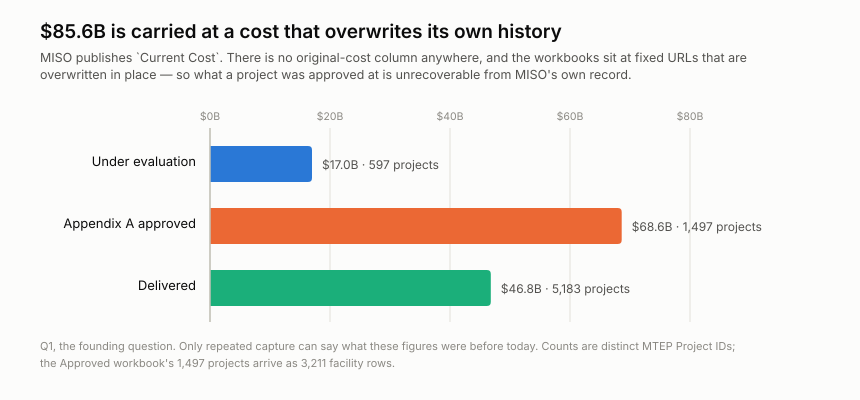
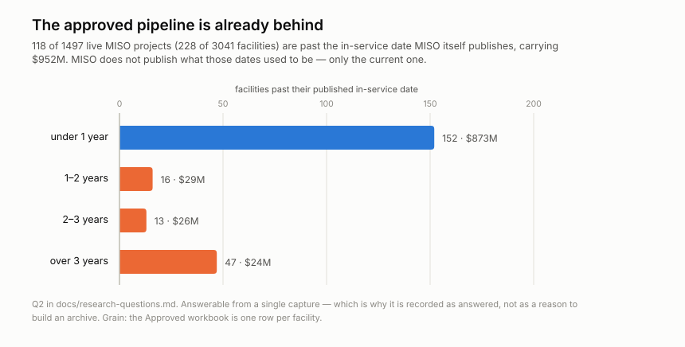
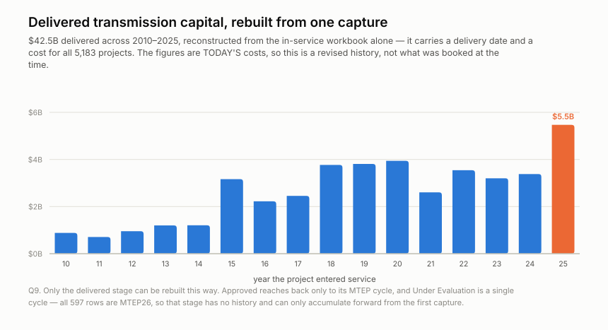
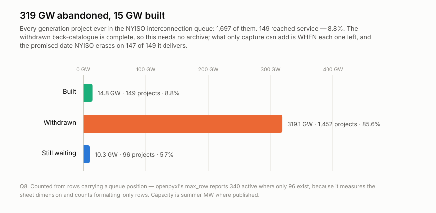
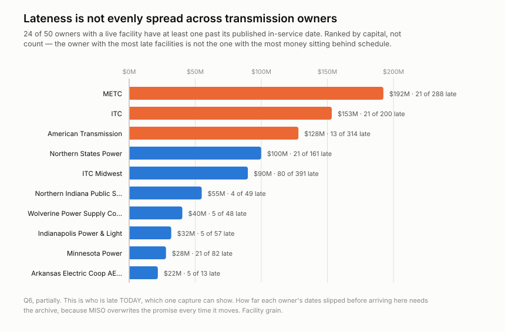
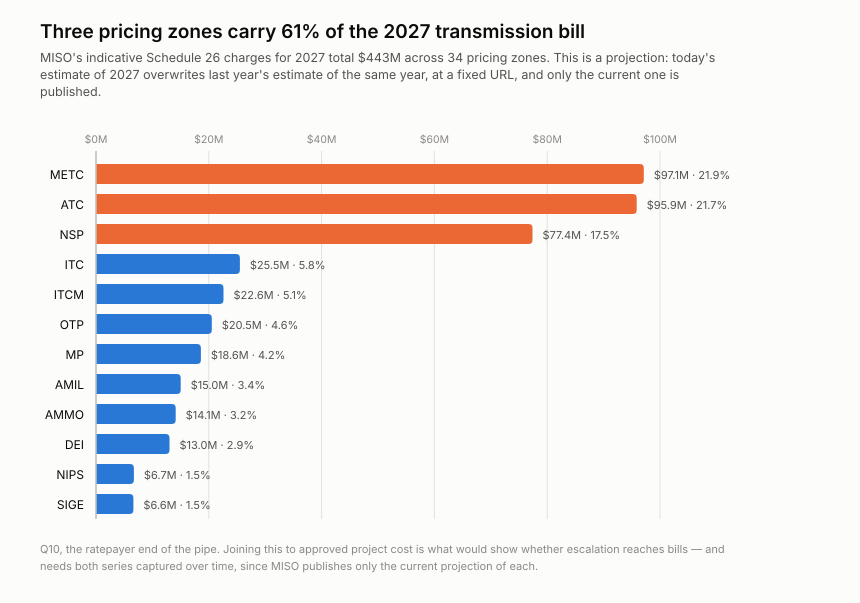
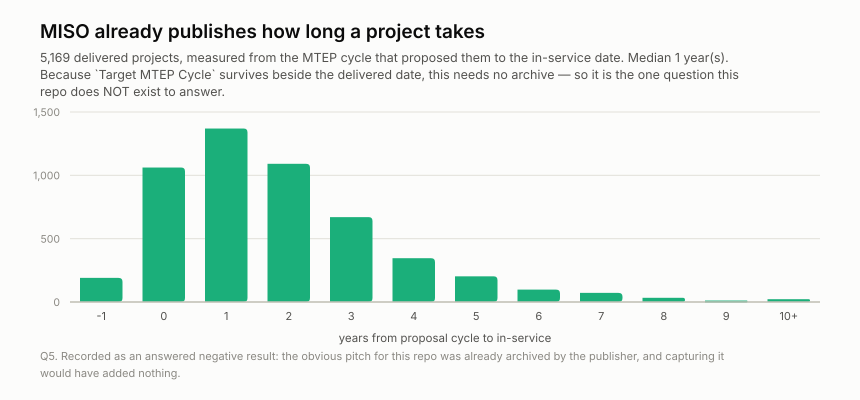

<h1 align="center">wss-grid-queue</h1>
<p align="center">
  <strong>Transmission project pipelines, kept where the cost is overwritten</strong>
</p>
<div align="center">
  <a href="https://github.com/q3dresearch/wss-grid-queue/actions/workflows/capture-monthly.yml"></a>
  <a href="https://github.com/q3dresearch/wss-grid-queue/commits"></a>
  <a href="https://github.com/q3dresearch/wss-grid-queue/blob/main/LICENSE"></a>
</div>

MISO plans the transmission grid for fifteen states. It publishes three
workbooks of projects — proposed, approved, delivered — and every figure in
them is a **current** value. There is no original-cost column and no promised
in-service date, and the files sit at fixed URLs that are overwritten in place.

**$85.6B of transmission is carried at a cost that overwrites its own
history.** What those projects were approved at is published nowhere.



The overwrite was proven before this repo existed, not assumed: the same URL
returns one sha for its advertised `?v=`, for a bogus `?v=19990101000000`, and
for no parameter at all — so the query string is cache-busting, not version
addressing. The landing page still advertises `?v=20250530143236` while
`last-modified` is 2026-06-18, meaning the version that link was minted for is
already unrecoverable.

## What one capture already shows



**118 of 1,497 approved projects (8%) are already past the in-service date MISO
itself publishes**, carrying $952M. Forty-seven of them are more than three
years over. MISO does not publish what those dates used to be — only the
current one, so the slip that produced them is invisible here and will only
become visible as captures accumulate.

## How much has been delivered, and when



One stage has real history inside a single capture: every in-service row carries
a delivery date and a cost, so **$42.5B of deliveries 2010–2025** can be rebuilt
without any archive at all, peaking at $5.5B in 2025. The approved stage reaches
back only to the MTEP cycle that approved it, and *Under Evaluation* has no past
whatsoever — all 597 rows are stamped `MTEP26`.

The costs are today's, so that reconstruction is a **revised** history. Whether
MISO restates a delivered project's cost after the fact is itself only visible
across captures, which is what makes every backfilled series provisional.

## What happens to a generation project in New York



The same question from the other end. MISO's files say what transmission
*costs*; NYISO's say what generation actually gets *built*.

**1,697 projects have entered the NYISO interconnection queue. 149 were built —
8.8%. 1,452 withdrew.** By capacity that is **319 GW abandoned against 14.8 GW
delivered**, twenty-one times more given up than connected. The 96 still waiting
have a median tenure of 7.2 years; the oldest has been in the queue 18.6.

That much needs no archive — the withdrawn back-catalogue is complete. What
only repeated capture can add is *when* each project left, and what its promised
date said before NYISO overwrote it, which it does on **147 of the 149** it
delivers.

## Who is late, and who pays



Lateness is concentrated. **24 of 50 owners** with a live facility have at least
one past its date, but ranked by *capital* rather than count the order changes:
METC has $192M behind schedule across 21 facilities, while ITC Midwest has four
times as many late facilities (80) for half the money.



At the other end of the pipe, MISO's indicative Schedule 26 charges for 2027
total **$443M across 34 pricing zones**, and three of them — METC, ATC and NSP —
carry 61% of it. Joining the two ends is Q10, and it needs both series captured
over time, because MISO publishes only the current projection of each.

## What this repo does NOT exist to answer



The obvious pitch — *how long does a transmission project take?* — is already
answerable from a single fetch, because `Target MTEP Cycle` survives beside the
delivered date. Median one year, p90 four, max fifteen, across 5,169 delivered
projects. Capturing that would have been archiving something already archived.

Recording the negative result is the point:
[`docs/research-questions.md`](docs/research-questions.md) carries thirteen
questions with honest statuses — three answered, two answered in part, six
waiting on captures to accumulate, one blocked, and exactly one naming a source
that does not exist yet. Only that last kind justifies adding to the registry.

## Who this is for

| who | the decision it changes |
| --- | --- |
| **State commission staff and consumer advocates** | whether to contest a rate filing. A utility's cost figure arrives with no published history to check it against |
| **Industrial energy buyers and data-centre siting teams** | which pricing zone to build in — three zones carry 61% of the 2027 charge, and the projections move |
| **Transmission developers and EPC contractors** | where to bid, and whose schedule to believe |
| **Generation developers with queued projects** | whether the transmission they depend on will arrive |
| **Energy journalists and grid analysts** | whether a cancellation was foreseeable from its cost history |

**Not for** anyone needing settlement-grade numbers. MISO states these values
are *"indicative only … not intended to be relied upon for settlement or
ratemaking purposes."* This is evidence about how estimates move, not a billing
record. Full version with per-question mapping in
[`docs/research-questions.md`](docs/research-questions.md#who-cares-and-what-they-would-do-differently).

## Coverage

Date ranges are machine-readable in [health/health.csv](health/health.csv)
(`first_success_at` → `last_success_at`, updated each run).

| series | what it lists | covered since | status |
| --- | --- | --- | --- |
| `miso.mtep.under-evaluation` | 597 projects / $17.0B awaiting an Appendix A decision | 2026-09 | ongoing |
| `miso.mtep.approved` | 1,497 projects across 3,211 facility rows / $68.6B | 2026-09 | ongoing |
| `miso.mtep.in-service` | 5,183 delivered projects / $46.8B | 2026-09 | ongoing |
| `miso.schedule26.charges` | indicative annual transmission charges per pricing zone, 5 years out | 2026-09 | ongoing |
| `miso.schedule26a.mvp` | Schedule 26-A, Multi-Value Project portfolio charges | 2026-09 | ongoing |
| `nyiso.interconnection.queue` | NY generation queue: 96 active, 1,452 withdrawn, 149 built | 2026-09 | ongoing, **local capture** |

Rules for this table: a **new series** gets a row with the date coverage
starts; a **discontinued series** keeps its row with a *covered until* date
and status *discontinued* — its data stays in the repo forever. Nothing
already published is removed.

## What you can build from it

Cost-escalation curves per project and per transmission owner; slip
distributions for `Expected ISD`; conversion rates from *Under Evaluation* to
*Appendix A approved* to *delivered*; and — once cancellations accumulate —
whether escalation predicts them.

**Mind the grain.** The Approved workbook is one row per *facility*: 3,211 rows
carry 1,497 distinct `MTEP Project ID`s, and `Current Cost` differs across a
project's facilities in 482 of the 496 projects that have more than one. Cost
must be summed across facilities, never deduplicated by project. Getting this
wrong halves the headline, silently — it did here once, before it was caught.

## How it runs

Three scheduled workflows, all on the **3rd of each month** — capture (00:20
UTC), health (02:40), derive (03:20) — powered by the
[wss](https://github.com/q3dresearch/wss-engine) engine, pinned to one
version. Monthly because MISO refreshes these workbooks around the turn of the
month; nothing here changes fast enough to justify weekly, and daily has never
changed an answer anywhere in this fleet. No workflow ever names a source: capture shards whatever
`registry/` marks active, so infrastructure never changes when sources do.
The bot commits **data only** — it never changes code; the one config it may
touch is flipping a repeatedly-failing source to `auto_disabled`, with an
issue explaining why.

## Adding a source

1. Add `registry/<source_id>.yml` (copy the example entry), `status: paused`.
2. Add a parser in `parsers/` if the payload shape is new.
3. `wss doctor <source_id>` — **read the raw response**.
4. Flip to `status: active`, add a Coverage row, commit.

Nothing else. No workflow edits, ever.

## Run it locally

```bash
python -m venv .venv && . .venv/bin/activate
pip install -r requirements.txt
export WSS_CONTACT="q3dresearch +https://github.com/q3dresearch/wss-grid-queue"  # identifies you to publishers

wss validate
wss doctor <source_id>
wss capture --cadence monthly
wss derive --parsers parsers.<module>
wss health --dry-run
```

## Going live

1. Push this repo **and the engine repo** under the same GitHub owner
   (`q3dresearch`) — the workflows install the engine from
   `github.com/q3dresearch/wss` at the pinned tag.
2. Set the repo secret **`WSS_CONTACT`** — capture refuses to run
   without it.
3. Run `capture-monthly` once by hand (Actions → capture-monthly → Run
   workflow), confirm the bot's data commit lands, then let the cron take
   over.

## Licences

Two separate files, on purpose: code is MIT ([LICENSE](LICENSE)); data
(`raw/`, `manifest/`, `derived/`) is CC-BY-4.0
([LICENSE-DATA](LICENSE-DATA)), citation in [CITATION.cff](CITATION.cff).
Captured content remains subject to the publisher's own terms.

Topics: `git-scraping` · `open-data` · `point-in-time-data` · `dataset`
